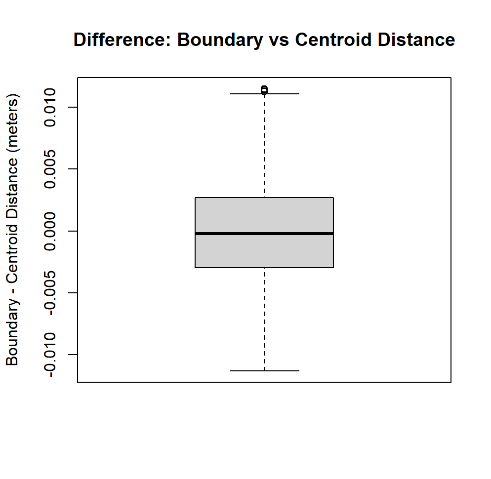

Estimated distance (in meters) from HDBs to the nearest parks in Singapore
================
Lina Ang
2025-05-30
Last updated: 21 Jan 2026

## About

This repository contains datasets in GeoPackage (.gpkg) and CSV (.csv) formats, detailing the estimated distances (in meters) from public residential buildings to the nearest nature parks or nature reserves in Singapore. All data in this public repository is free to use and download, as they are generated using open-source datasets. 

## Data sources used 
1) <a href="https://data.gov.sg/datasets?query=hdb&resultId=d_17f5382f26140b1fdae0ba2ef6239d2f&page=1" target="_blank">HDB Property Information</a>
2) <a href="https://data.gov.sg/datasets?query=nature+parks&page=1&resultId=d_77d7ec97be83d44f61b85454f844382f" target="_blank">NParks Parks and Nature Reserves</a> 
3) <a href="https://www.onemap.gov.sg/apidocs/maps" target="_blank">OneMap API</a>

## Variables
 [1] "blk_no"                 "street"                 "postal"                 "max_floor_lvl"         
 [5] "year_completed"         "residential"            "commercial"             "market_hawker"         
 [9] "miscellaneous"          "multistorey_carpark"    "precinct_pavilion"      "bldg_contract_town"    
[13] "total_dwelling_units"   "X1room_sold"            "X2room_sold"            "X3room_sold"           
[17] "X4room_sold"            "X5room_sold"            "exec_sold"              "multigen_sold"         
[21] "studio_apartment_sold"  "X1room_rental"          "X2room_rental"          "X3room_rental"         
[25] "other_room_rental"      "address"                "dist_to_park_centroid"  "dist_to_park_boundary" 
[29] "diff_boundary_centroid" "park_area"              "park_length"            "park_name"             
[33] "SVY21_X"                "SVY21_Y"                "longitude"              "latitude"   

- "postal", "longitude", "latitude" was generated using OneMap API.
  
### Variables of interest
1) **dist_to_park_centroid**: estimation of residential building to the nearest park in meters, calculated using the SVY21 projected coordinate system (EPSG:3414) based on the X,Y coordinates of the HDB to the nearest park's centroid
2) **dist_to_park_boundary**: estimation of residential building to the nearest park in meters, calculated using the SVY21 projected coordinate system (EPSG:3414) based on the X,Y coordinates of the HDB to the nearest park's boundary (circumference)
3) **diff_boundary_centroid**: the difference of the two distance estimation (in meters): dist_to_park boundary - dist_to_park_centroid
4) **park_name**: name of nearest park to residential building

### Boxplot of distance difference: boundary vs centroid  
The boxplot of distance difference between the park boundary and centroid shows a mean difference of 0. Both distance estimates are consistent and reliable.

## HDB mapped
Dataset last updated: Dec 2024

## Nature parks and nature reserves mapped
Dataset last updated: 25 Nov 2024

## Visualize distance from HDBs to their nearest parks (n=5)

- The distance is calculated based on the X,Y coordinates of the HDB to the nearest park's centroid (X,Y).

## Limitation
Calculating the distance from each HDB to its nearest park entrance along walkable pathways, rather than to the park's boundary or centroid, would provide a more accurate estimate.

## Contact
For more information, please email me at [Lina Ang](mailto:bananaleaf1sg@gmail.com?subject=Inquiry%20about%20distance-to-park%20Repository).
